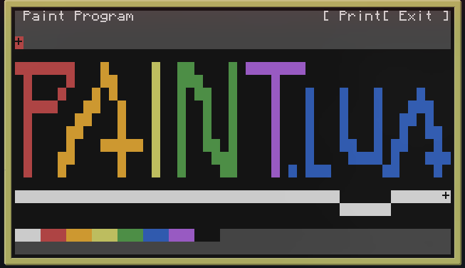

# Paint.lua

A program inspired by MS Paint for Minecraft's CraftOS. Written in Lua for a school project 

# Installation
Run the following command in your terminal
```shell
wget run https://raw.githubusercontent.com/MTech-cmd/paint.lua/main/install.lua
```

# Usage
Run the program by invoking it's name `paint`.\
Use the arrow keys or the mouse to navigate the canvas.\
Press down or hit space to put down a pixel.
Press on a color on the color bar or hit C to scroll through colors.\
hit P or [ Print ] to print to an adjacent printer.\
Hit Q or [ Exit ] to exit the computer the OS entirely.